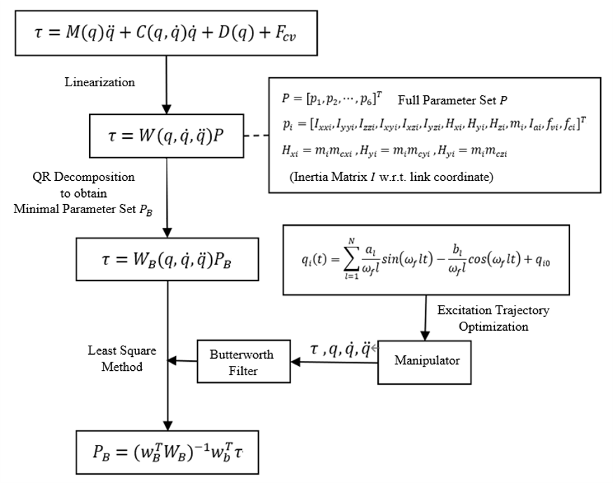



## RAMIS-based Optimal Control and Motion Planning for RCM-constrainted Redundant Manipulator
* 08/2022 - Present
* In collaboration with Ruiqi Rao from Sun Yat-Sen University 
* Advisor: Prof. Weibing Li

The [RoboMaster University Sim2Real Challenge at ICRA 2022]

## Teaching-by-Demonstration Scheme for Robotic Compliant Skills
* 03/2022 - 06/2022
* Faculty of Robot Science and Engineering, Northeastern University
* Advisor: Prof. Lijin Fang

  

In this paper, we first model the dynamics of the celluloid XMate3Pro robot and identify the parameters. In this paper, the robot dynamics is modeled by the Newton-Euler method and the friction is modeled using the Coulomb viscous hysteresis model. The excitation trajectory of the fifth-order Fourier series is used to obtain the robot motion data, and then the least-squares method is used to identify the minimum parameter set. The root-mean-square error between the identified and actual moments of each joint is calculated to be within 0.5 Nm, and the identification accuracy is high. The torque during robot motion can be solved by parameter identification, and the dragging method based on torque control can be further realized on this basis.
In the aspect of flexible dragging technology, the position control-based dragging method and the moment control-based dragging method are studied in this paper. In terms of position-controlled drag, this paper designs a variable-conductor scheme based on the direct and indirect intentions of the operator, which can adjust the virtual damping according to the drag speed to achieve variable-speed drag based on the operator's intention, and predict the operator's desired force direction by calculating the curvature of the drag to guide the operator to drag a straight line or curve. The experimental results show that, compared with the constant guide, the drag control method using variable guide can improve the position tracking accuracy of the trajectory drag, shorten the drag time, make the robot arm respond to the operator's intention quickly and flexibly and correct the drag errors and jitter. Meanwhile, this paper designs a dragging method based on moment control according to the identified kinetic parameters. The method realizes moment control by calculating gravity, friction and Koch force compensation in real time and introducing speed feedback. The method can be dragged freely to the specified position according to the operator's demand. Experiments show that the error of torque compensation is within a reasonable range, and the operator only needs to use a small external force to drag the robot easily, which can be applied in low-speed motion and low-precision work tasks.
For the robot arm trajectory following control, this paper designs a sliding mode control based on delay estimation. In the design of the controller, we use the delay estimation method to implement the model estimation, combine with the sliding mode control to improve the tracking accuracy, and apply the saturation function to the sliding mode control to alleviate the jitter problem. In order to verify the effectiveness of the used trajectory following controller, the paper designs four different controllers for comparison experiments and proves that the controller designed in this paper can better perform the trajectory following control task. Based on this, this chapter uses the controller to conduct the robot arm trajectory following experiment, and after calculating the tracking error of each joint is kept within order of magnitude, which shows that the position tracking accuracy of this method is high and has certain practical value.

[[Project Thesis (Complete)](https://www.jianguoyun.com/p/DQAfQGgQkOm1CRjAi_cEIAA)]
[[Thesis on Dynamic Identification](https://www.jianguoyun.com/p/DUbc1G0QkOm1CRjKi_cEIAA)]
[[Code](https://github.com/YanjunLIU-ac/Dynamic_Parameter_Identification_for_Rokae_xMate)]

## Indoor 3D Scene Understanding and Modelling
* 08/2020 - 08/2021
* Publication: one paper submitted to IEEE Trans. on Multimedia
* Visual Information Processing Lab, SIGS, Tsinghua University
* Advisor: Prof. Wenming Yang

  

Indoor 3D object detection is an essential task in single image scene understanding, impacting spatial cognition fundamentally in visual reasoning. Existing works on 3D object detection from a single image either pursue this goal through independent predictions of each object or implicitly reason over all possible objects, failing to harness relational geometric information between objects. To address this problem, we propose a dynamic sparse graph pipeline named Explicit3D based on object geometry and semantics features. Taking the efficiency into consideration, we further define a relatedness score and design a novel dynamic pruning algorithm followed by a cluster sampling method for sparse scene graph generation and updating. Furthermore, our Explicit3D introduces homogeneous matrices and defines new relative loss and corner loss to model the spatial difference between target pairs explicitly. Instead of using ground-truth labels as direct supervision, our relative and corner loss are derived from the homogeneous transformation, which renders the model to learn the geometric consistency between objects. The experimental results on the SUN RGB-D dataset demonstrate that our Explicit3D achieves better performance balance than the-state-of-the-art.

  

[[Bachelor Thesis](https://www.jianguoyun.com/p/DcQ3d_IQkOm1CRjFi_cEIAA)]
[[arxiv](https://www.jianguoyun.com/p/DUXGruoQkOm1CRiwk_cEIAA)]

## sEMG-based Sign Language Recognition for the Hearing-impaired
* 03/2020 - 05/2020
* Human-Robot Collaboration Lab, Faculty of Robot Science and Engineering, Northeastern University
* Publication: one paper in IEEE ROBIO, one paper in IEEE CYBER, one paper in Applied Intelligence
* Advisor: Prof. Fei Wang

  
  

This research proposes a 1D-CNN for fusing gyroscope and electromyography (EMG) signals for hand sign word recognition, achieving an accuracy of 96% on a laboratory-built dataset of 200 words with approximately 10,000 samples collected from 20 participants. Furthermore, a twin-neural network-based online hand sign recognition framework is proposed, which compares the sliding window signal with the standard vector learned by the twin-neural network, achieving a recognition rate of 102 milliseconds per sentence with an 82% accuracy on a large-scale long-sentence dataset built in the laboratory. The results have won the Silver Prize of the 5th “Internet” Innovation and Entrepreneurship Competition, the Gold Prize of the 6th “Internet” Innovation and Entrepreneurship Competition, and two conference papers and one SCI paper have been published in collaboration with members of the laboratory.

[[IEEE ROBIO Paper](https://ieeexplore.ieee.org/abstract/document/8961831/)]
[[IEEE CYBER Paper](https://ieeexplore.ieee.org/abstract/document/9279125/)]
[[Applied Intelligence Paper](https://link.springer.com/article/10.1007/s10489-020-02170-9)]
