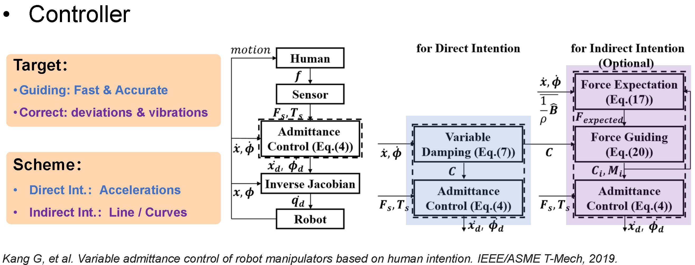
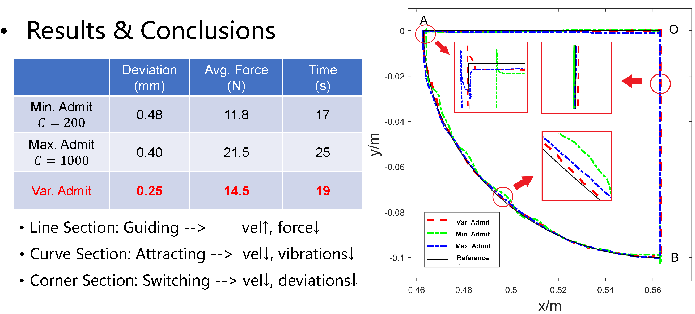



## Optimal Control of RCM-constrained Redundant Manipulator in RAMIS
* 08/2022 - Present

Robot-Assisted Minimally Invasive Surgery (RAMIS) uses long and slender surgical tools rigidly mounted on the robot's end-effector, which are controlled by the surgeon via a hands-on or tele-operation setup. During a RA-MIS, the robot tool-tip performs a task inside the patient’s body. Simultaneously, the tool movements are constrained by the trocar where the contact forces must be minimized, in order to avoid any injury to the patient. The kinematic constraint generated by the incision point is commonly known as the Remote Center of Motion (RCM) constraint. 

  
  

  
  

As depicted in the left figure, mechanically RCM-constrainted robot manipulators have a fixed pivot point within the workspace. In this project, the kinematically redundant Emika Frank Panda manipulator is used to study a variety of relevant control and planning tasks.

The central idea of RCM-constrainted optimal control is to formulate the end-effector task as a Quadratic Programming (QP) Problem. The redundant manipulator nullspace enables the optimization of multiple tasks simultaneously. Currently, our primary research topics include reactive manipulability-maximising motion control, admittance control for hands-on RAMIS (demonstrated in the right figure), motion control of rigid-flexible integrated instrument etc. in RAMIS scenario.

## Teaching-by-Demonstration Scheme for Robotic Compliant Skills
* 03/2022 - 06/2022
* Faculty of Robot Science and Engineering, Northeastern University
* Advisor: Prof. Lijin Fang

<iframe width="336" height="189" src="https://www.youtube.com/embed/0tn974odp6Q" title="YouTube video player" frameborder="0" allow="accelerometer; autoplay; clipboard-write; encrypted-media; gyroscope; picture-in-picture; web-share" allowfullscreen></iframe>

This project aims to investigate the method for demonstrating and teaching robotic compliant skills. Its primary contents include dynamic parameter identification, compliant dragging, and trajectory tracking. Our experiment platform is based on the Rokae xMate3Pro manipulator.

For the identification portion, we modeled the robot's dynamics using 13 parameters per joint, including Coulomb friction. A Fourier-series based excitation trajectory and Least Squares Method were used for parameter identification. The experimental results indicated that the root Mean Square Error between the calculated and actual torque of each joint was within 0.5Nm.

For the compliant dragging portion, we devised a variable admittance scheme based on the operator's direct and indirect intentions. The scheme can adjust the virtual damping to modulate the dragging speed based on the operator's intent, while predicting the operator's desired force direction by calculating the path's curvature to guide the operator. The experiments show that the variable damping method can improve dragging precision and reduce dragging time. Variable admittance scheme is capable of making the manipulator respond rapidly to the operator's intent and correcting dragging errors and jitter compared to constant damping scheme. Some of the system details are shown below.

  
  

For the trajectory tracking portion, we used the Time Delay Estimation (TDE) method in combination with Sliding Mode Controller (SMC) to improve the tracking accuracy. Experiments were conducted to track the target dragging trajectory using the proposed controller, and the tracking error of each joint was reduced to within 1e-3 radians.

[[Project Thesis (Complete)](https://www.jianguoyun.com/p/DQAfQGgQkOm1CRjAi_cEIAA)]
[[Thesis on Dynamic Identification](https://www.jianguoyun.com/p/DUbc1G0QkOm1CRjKi_cEIAA)]
[[Code](https://github.com/YanjunLIU-ac/Dynamic_Parameter_Identification_for_Rokae_xMate)]

## Indoor 3D Scene Understanding and Modelling
* 08/2020 - 08/2021
* Publication: one paper submitted to IEEE Trans. on Multimedia, under review
* Visual Information Processing Lab, SIGS, Tsinghua University
* Advisor: Prof. Wenming Yang

  

The detection of indoor 3D objects is a crucial component of single-image scene comprehension, with profound effects on spatial cognition and visual reasoning. Existing works on 3D object detection from a single image either independently predict each object or implicitly reason over all possible objects, failing to exploit relational geometric information between objects. To address this issue, we propose Explicit3D, a dynamic sparse graph pipeline based on object geometry and semantic properties. Considering efficiency, we define a relatedness score and design a novel dynamic pruning algorithm followed by a cluster sampling technique for sparse scene graph generation and updating. In addition, Explicit3D introduces homogeneous matrices and defines new relative loss and corner loss in order to explicitly model the spatial difference between target pairs. Instead of using ground-truth labels as direct supervision, our relative and corner loss are derived from the homogeneous transformation, which allows the model to discover the geometric consistency between objects. The experimental results on the SUN RGB-D dataset demonstrate that Explicit3D achieves a better performance-complexity balance than the current state of the art.

  

[[Bachelor Thesis](https://www.jianguoyun.com/p/DcQ3d_IQkOm1CRjFi_cEIAA)]
[[arxiv](https://arxiv.org/abs/2302.06494)]

## sEMG-based Sign Language Recognition for the Hearing-impaired
* 03/2019 - 05/2020
* Human-Robot Collaboration Lab, Faculty of Robot Science and Engineering, Northeastern University
* Publication: one paper in IEEE ROBIO, one paper in IEEE CYBER, one paper in Applied Intelligence
* Advisor: Prof. Fei Wang

  
  

This research aims to develop a Sign Language Recognition (SLR) system to assist the hearing-impaired and to inspire future studies on human-robot collaboration. We captured sign language signals using Myo armbrand (shown on the left) embedded with sEMG(surface-electromyogram)sensors and IMU (inertial measurement unit) (shown on the right). The central idea of this project is to develop a method for classifying sign language words and translating sign sentences using multimodal information fusion.

We proposed a 1D-CNN as the baseline for signal fusion, achieving an accuracy of 96% on a laboratory-constructed dataset of 200 words with approximately 10,000 samples from 20 participants. In addition, several derivative works on the integration system of sign language and visual speech (ROBIO Paper), data generation and amplification (CYBER Paper), and few-shot learning (Applied Intelligence Paper) have been published. Our project has been awarded the Silver Prize in the fifth "Internet Plus" Innovation and Entrepreneurship Competition.

[[IEEE ROBIO Paper](https://ieeexplore.ieee.org/abstract/document/8961831/)]
[[IEEE CYBER Paper](https://ieeexplore.ieee.org/abstract/document/9279125/)]
[[Applied Intelligence Paper](https://link.springer.com/article/10.1007/s10489-020-02170-9)]
[[Competition News](http://www.rse.neu.edu.cn/2019/1016/c2146a145673/page.htm)]
